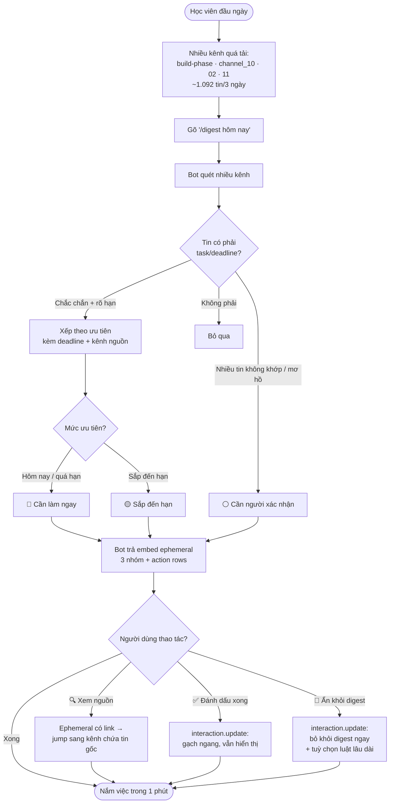

# CP2 · Cho thấy luồng hoạt động — "Priority Digest"

> **Hạn nộp: 21:00 · 16/9** · Đội trưởng nộp thay cả nhóm (5 điểm).
> Mốc này **chưa cần AI chạy thật** (cái đó để CP3). Chỉ cần cho thấy luồng từ đầu đến cuối.
> Nối tiếp lát cắt đã chốt ở [CP1-canvas.md](CP1-canvas.md) — Track B · B2 "Priority Digest".

---

## Nộp gì cho CP2

BTC cho nộp **một trong ba**; nhóm nộp **cả hai** cho chắc:

1. **Bản mock bấm được** → [`mock/priority-digest.html`](mock/priority-digest.html)
   Mock **mô phỏng đúng một workspace Discord**: sidebar nhiều kênh (`#build-phase` · `#channel_10`
   · `#channel_02` · `#channel_11`); người dùng gõ `/digest`, bot trả **embed** gom task/deadline
   **từ nhiều kênh** theo ưu tiên (mỗi mục ghi rõ **kênh nguồn**). Dưới embed là **action row** thật:
   select menu **🔍 Xem nguồn/ngữ cảnh** (đưa link jump tới tin gốc, kể cả kênh khác) · **✅ Đánh dấu
   đã xong** (gạch ngang, vẫn hiển thị) · **🙈 Ẩn khỏi digest** (bỏ ngay + tuỳ chọn luật lâu dài).
   **Chưa gọi AI** (giao diện tĩnh), nhưng các tin là **trích dẫn thật** từ
   `data/discord-pack/k4_messages.csv` (ẩn danh `D####`, ≤2 câu/tin): `M78917`, `M01982`, `M19124`,
   `M50841`; riêng tin Workshop do bạn cung cấp (tác giả **Odin**). Số "654 tin" là số thật của `channel_10`.
2. **Sơ đồ luồng** → phần "Sơ đồ luồng" bên dưới.

Tiêu chí xác minh CP2 (rubric): ☐ flow chính bấm hết được ☐ repo có commit.

---

## Luồng một câu

Học viên gõ **`/digest`** trong Discord → bot **quét nhiều kênh** → trả về một **embed** gom **task + deadline (kèm mốc thời gian cụ thể) sắp theo ưu tiên**, mỗi mục ghi rõ **thuộc kênh nào** và có link nhảy thẳng tới tin gốc → học viên nắm việc trong 1 phút.

## Các bước người dùng

| # | Người dùng thấy / làm | Hệ thống (bot) làm |
|---|---|---|
| 1 | Nhiều kênh cùng "quá tải": **#build-phase · #channel_10 · #channel_02 · #channel_11**, tổng ~1.092 tin/3 ngày | — (bối cảnh nỗi đau ở CP1) |
| 2 | Gõ slash command **`/digest hôm nay`** | **Quét nhiều kênh**, phân loại từng tin: task/deadline hay bỏ qua |
| 3 | Bot trả **embed** chia 3 nhóm: 🔴 Cần làm ngay · 🟡 Sắp đến hạn · ⚪ Cần người xác nhận — **mỗi mục ghi rõ deadline cụ thể + kênh nguồn** (vd *trước 10:00 · #channel_10*) | Sắp theo ưu tiên; mục **không chắc** đẩy vào "Cần người xác nhận" (không đoán liều) |
| 4 | Mở **select menu "🔍 Xem nguồn / ngữ cảnh…"**, chọn 1 mục | Bot trả ephemeral có **link nhảy tới tin gốc**; bấm link → Discord **chuyển sang kênh chứa tin** và highlight đúng tin (jump-to-message, kể cả tin ở kênh khác). Mục "cần xác nhận" có **2 tin ở 2 kênh** → 2 link + kết luận |
| 5 | Mở **select menu "✅ Đánh dấu đã xong…"**, chọn nhiều mục → Áp dụng | Bot **sửa lại chính message digest** (`interaction.update`) → mục bị **~~gạch ngang~~** (Discord markdown), **vẫn hiển thị**; bộ đếm "việc có hạn" giảm. Ephemeral kèm nút **↩️ Hoàn tác** (bỏ gạch ngang). Digest mới ngày mai mới bỏ hẳn |
| 6 | Mở **select menu "🙈 Ẩn khỏi digest…"**, chọn mục → Áp dụng | Bot **ẩn ngay** mục khỏi message digest (`interaction.update`) + ephemeral xác nhận có nút **↩️ Hoàn tác** (khôi phục — bắt buộc đưa ngay vì mục đã ẩn thì không click lại được) và nút tuỳ chọn *🚫 Luôn bỏ qua loại này* (tạo **luật lọc cá nhân**) |

> **Mọi thành phần đều là capability có thật của Discord bot** (không bịa UI): slash command · embed (chỉ chứa text) · **select menu** (single & multi) · **button** · **ephemeral message** · sửa message tại chỗ (`interaction.update`). Component tương tác nằm ở **action row dưới embed** — Discord không cho đặt nút trong embed.
>
> **Đã làm đúng theo Discord thật (không fake):**
> 1. **Tổng hợp đa kênh** — digest gom deadline từ nhiều kênh (mỗi mục ghi rõ kênh nguồn); sidebar cho duyệt từng kênh như Discord thật.
> 2. Đánh dấu xong → bot **sửa lại chính message** (`interaction.update`) và **gạch ngang** mục đó bằng markdown `~~...~~` — vẫn hiển thị, không xoá (embed không đổi màu chữ từng từ được, nên gạch ngang + làm mờ là tối đa Discord cho phép).
> 3. "Xem nguồn/ngữ cảnh" → bot đưa **link nhảy tới tin gốc**; bấm link **chuyển sang đúng kênh chứa tin** (kể cả kênh khác) và highlight tin đó — đúng **jump-to-message** của Discord (message link `discord.com/channels/<guild>/<channel>/<msg_id>`).
> 4. Gắn theo **từng mục** qua select menu, không để nút rời ở đáy.
>
> Chi tiết đối chiếu: xem `mock/priority-digest.html`.

> **Hai điểm đã sửa theo phản hồi:**
> 1. Mục 🔴 **luôn kèm mốc deadline cụ thể**, không chỉ nói "cần làm ngay".
> 2. Mục ⚪ "cần xác nhận" khi có **nhiều tin ở nhiều kênh nói khác nhau** (vd deadline "ghép đội tự do": `M19124`@#channel_02 hỏi "sao end sớm", `M50841`@#channel_11 trả lời "cửa sổ đã đóng") thì cho **link nhảy tới từng tin** để nắm bối cảnh — đúng automation **Conditional** ở CP1: AI không tự chốt khi thông tin chưa khớp.

## Sơ đồ luồng

## Ghi chú ranh giới (để CP3 làm tiếp)

- CP2 = luồng + mock tĩnh, **không** gọi AI.
- CP3 = thay bước 2–3 bằng **lời gọi AI thật** trên `data/discord-pack/`, quay video 30s + đo golden set (bao nhiêu tin phân loại đúng / bao nhiêu sai).
