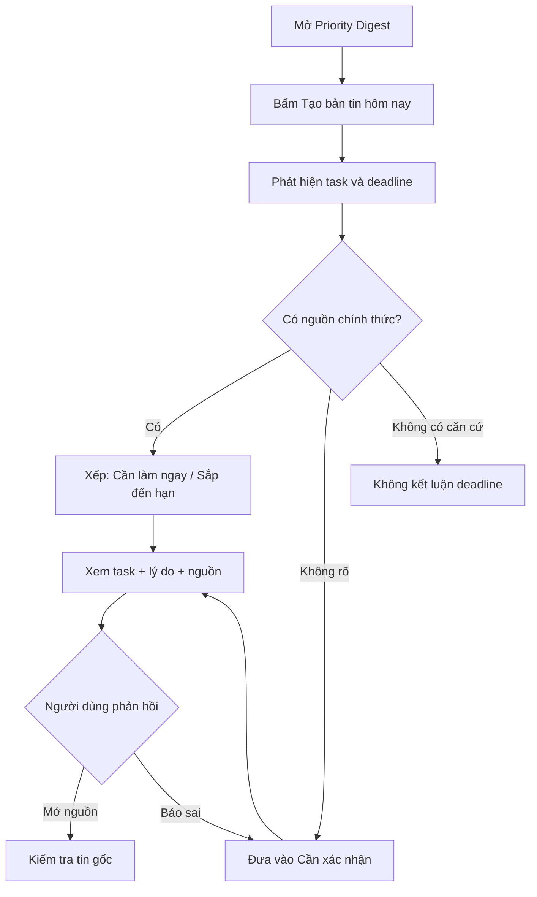

# CP2 · Priority Digest — Clickable Mock

## Artifact

- Mock: [`codebase/index.html`](codebase/index.html)
- Hướng dẫn chạy: [`codebase/README.md`](codebase/README.md)
- Mức prototype tại CP2: **Mock** — flow bấm được, dùng fixture; chưa gọi AI thật.

## Lát cắt được thể hiện

> Một học viên mở Discord đầu ngày · cần biết các nghĩa vụ học tập sắp tới · hệ thống phát hiện task/deadline, chỉ tự đưa mục có nguồn chính thức vào digest và tách mục chưa chắc để xác nhận · học viên biết việc ưu tiên và tự kiểm được qua nguồn.

## Sơ đồ luồng

## Các đường đi có thể demo

| Đường đi | Cách mở trong mock | Kết quả mong muốn |
|---|---|---|
| Happy path | Tạo bản tin → chọn “Nộp Canvas CP1” | Hiện deadline, mức ưu tiên, lý do và nguồn đã xác minh |
| Low-confidence | Menu “Cần xác nhận” → chọn “Daily standup” | Không tự điền deadline; yêu cầu kiểm tra tin gốc |
| Failure/không căn cứ | Thanh “Thử tình huống” → “Không có căn cứ” | Nói rõ chưa tìm thấy deadline chính thức |
| Correction | Mở một task đã xác minh → “Báo deadline sai” | Gỡ trạng thái xác minh và chuyển sang kiểm tra lại |

## Checklist CP2

- [x] Flow chính bấm đi hết được.
- [x] Có dữ liệu giả/fixture và ghi rõ phần mock.
- [x] Có happy path và cách xử lý khi thiếu căn cứ.
- [x] Có link/nút quay về nguồn cho từng kết quả.
- [x] Có correction flow để người dùng báo deadline sai.
- [x] Không cần AI thật ở CP2; AI call trung tâm sẽ được bổ sung tại CP3.
