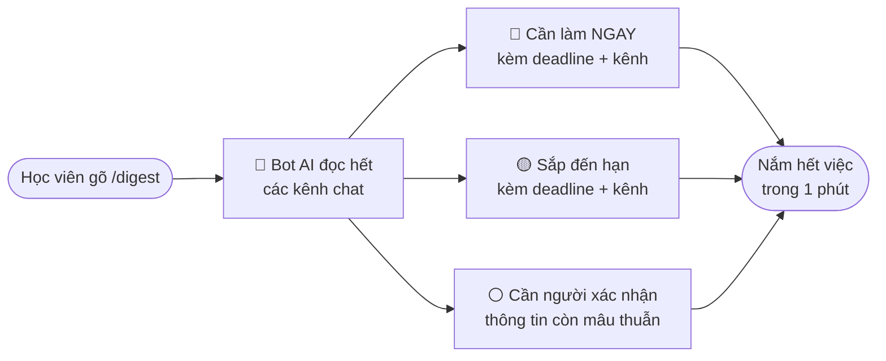
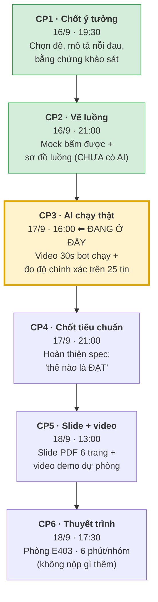
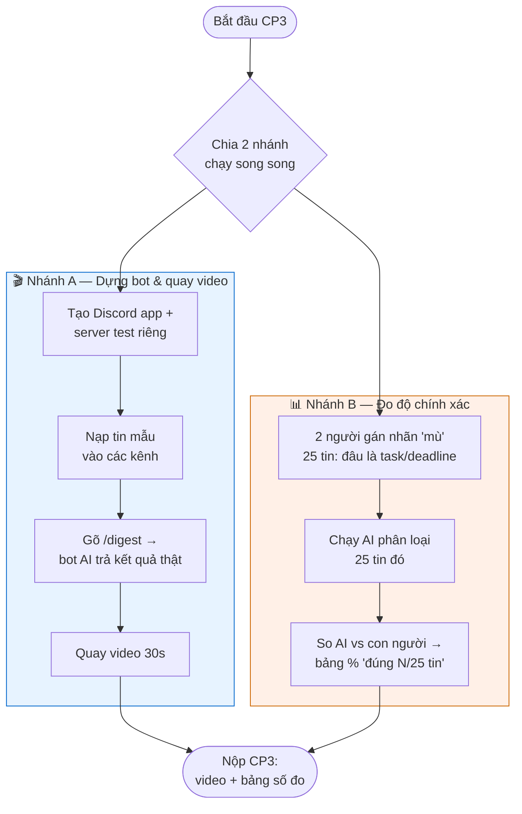
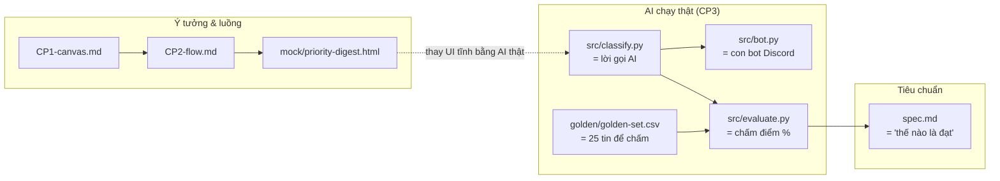
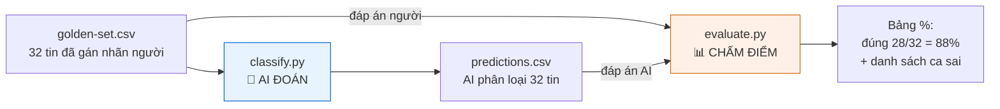

# WORKFLOW — Bức tranh toàn cảnh dự án "Priority Digest"

> Đọc file này để hiểu **cả dự án đang làm gì** mà không cần biết code.
> Chủ đề đã chốt ở [CP1-canvas.md](CP1-canvas.md): **Track B — "Priority Digest"**, một con bot Discord
> giúp học viên biết *"hôm nay có việc/deadline gì, ở đâu"* chỉ trong 1 phút, thay vì phải đọc hết hàng trăm tin.

---

## 1. Sản phẩm giải quyết nỗi đau gì? (giải thích cho người non-tech)

Tưởng tượng bạn là học viên mới. Mỗi sáng mở Discord thấy **4 kênh chat, hơn 1.000 tin trong 3 ngày**.
Deadline quan trọng nằm lẫn giữa hàng trăm tin tán gẫu → **dễ bỏ sót → trễ hạn, mất điểm**.

**Priority Digest** = một trợ lý AI. Bạn chỉ cần gõ **`/digest`**, nó đọc hết các kênh giúp bạn và trả về
một bảng gọn gàng chia 3 nhóm:



**Điểm khác biệt cốt lõi:** BTC đã có sẵn 1 con bot nhắc lịch, nhưng nó **sai** vì phải chờ người cập nhật tay
→ tin cũ. Sản phẩm này **đọc thẳng tin gốc** nên luôn mới; và khi thông tin mâu thuẫn thì **hỏi lại (⚪)**
chứ không đoán liều.

---

## 2. Hành trình 6 checkpoint (CP) — dự án đi qua những cửa nào

Cuộc thi chia thành 6 mốc nộp bài (checkpoint). Mỗi mốc là một "cửa" phải qua, làm rõ dần từ **ý tưởng → chạy thật → thuyết trình**.



🟢 CP1, CP2 = **đã xong**.  🟡 CP3 = **đang làm** (hạn hôm nay 16:00).  ⚪ CP4→CP6 = làm sau.

**Mỗi CP làm rõ thêm một tầng:**

| CP | Câu hỏi mà mốc này trả lời | Nộp cái gì |
|---|---|---|
| CP1 | *Ta giải quyết nỗi đau gì, cho ai?* | Canvas 7 dòng + repo |
| CP2 | *Luồng dùng trông ra sao?* | Mock bấm được + sơ đồ |
| CP3 | *AI có thật sự chạy & đúng không?* | Video 30s + bảng số đo % |
| CP4 | *"Đạt" nghĩa là gì?* (chốt trước khi biết kết quả) | Spec hoàn thiện |
| CP5 | *Kể câu chuyện này thế nào?* | Slide PDF + video dự phòng |
| CP6 | *Thuyết phục hội đồng* | Trình bày 6 phút |

---

## 3. Bên trong CP3 — mốc đang làm (chi tiết nhất)

CP3 chạy **2 nhánh song song** để kịp giờ. Một nhánh dựng bot để quay video, một nhánh đo xem AI đoán đúng bao nhiêu.



**Vì sao phải "gán nhãn mù trước khi chạy AI"?** Để chấm điểm công bằng: con người tự quyết đâu là đáp án đúng
*trước*, rồi mới xem AI đoán trùng bao nhiêu. Nếu chấm sau khi biết AI trả gì thì dễ thiên vị.

> 💡 Mẹo ghi điểm: **số xấu vẫn được điểm nếu thật** — kèm phân tích *"vì sao mấy ca kia sai"*
> còn ăn điểm cao hơn là khoe "chạy tốt" mà không có bằng chứng.

---

## 4. Ai làm gì (đội T009)

```mermaid
flowchart LR
    A["👤 A — Đội trưởng<br/>Lê Tuấn Anh"] --> A1[Lập Discord app +<br/>server + mời bot · Nộp form]
    B["👤 B"] --> B1[Nạp data vào kênh +<br/>quay video 30s]
    CD["👥 C + D"] --> CD1[Gán nhãn mù 25 tin<br/>(2 bản độc lập)]
    E["👤 E"] --> E1[Chạy đo số +<br/>viết phân tích 'vì sao sai']
```

> ⚠️ **Luật vibe-coding:** mỗi người phải **giải thích được** phần code mang tên mình,
> nếu không phần đó **0 điểm**. Code trong `src/` có chú thích tiếng Việt để dễ đọc trước khi demo.

---

## 5. Nối các mảnh lại — file nào ứng với việc gì



- `classify.py` = **bộ não AI**: đọc tin → phân loại task/deadline (dùng model OpenAI gpt-4o-mini).
- `bot.py` = **khuôn mặt**: con bot Discord nhận lệnh `/digest` rồi gọi bộ não trả kết quả.
- `golden-set.csv` + `evaluate.py` = **thước đo**: so AI với đáp án người để ra con số %.
- `spec.md` = **hợp đồng chất lượng**: chốt "đạt khi ≥ X% đúng" *trước* khi biết kết quả (khóa ở CP4).

---

## 6. Hai file lõi CP3 làm gì — `classify.py` & `evaluate.py`

Đây là 2 file kỹ thuật quan trọng nhất của CP3. Hình dung một dây chuyền 2 khâu:
**`classify.py` cho AI đoán → `evaluate.py` chấm điểm cái AI vừa đoán.**



### 6a. `classify.py` — bộ não AI (khâu ĐOÁN)

**Việc nó làm:** đọc từng tin Discord → hỏi OpenAI (gpt-4o-mini) → trả về mỗi tin thuộc nhóm nào,
deadline là gì, kênh nào. Đây chính là **"≥1 lời gọi AI chạy thật"** mà CP3 bắt buộc — không hardcode kết quả.

Mỗi tin được xếp vào **1 trong 4 nhóm:**

| Nhóm | Nghĩa | Ví dụ |
|---|---|---|
| 🔴 `do_now` | Có mốc hạn, đã quá hạn hoặc còn **≤ 2 ngày** | "Gate 1 chốt 23:59 hôm nay" |
| 🟡 `soon` | Có mốc hạn, còn **> 2 ngày** | "hạn đăng ký đề tài 20/9" (còn 6 ngày) |
| ⚪ `confirm` | Liên quan deadline nhưng **mâu thuẫn/mơ hồ** → không tự chốt | "sao deadline ghép đội end sớm vậy?" ↔ "cửa sổ đã đóng" |
| ⚫ `skip` | Không phải task/deadline (tán gẫu, hỏi vu vơ, link, tag) | "oke nhé", "tối có đi lab k" |

**Vài chỗ đáng chú ý trong code (để giải thích khi demo — luật vibe-coding):**
- Luật phân loại viết bằng tiếng Việt ngay trong biến `SYSTEM` (dòng 36) → sửa luật là sửa ở đây.
- `REFERENCE_NOW` (dòng 33) = ngày AI coi là "hôm nay": **cố định 14/9** khi chấm điểm (để tái lập được số), nhưng **ngày thật** khi bot chạy live.
- `temperature=0` (dòng 102) → cùng input luôn cho cùng output (đây là fix ở lượt 4 giúp số ổn định 88%).
- 3 luật cứng chống lỗi hay gặp: **`sent_at` (giờ gửi) ≠ deadline**, **đối chiếu cả lô** để bắt ca mâu thuẫn, và **câu hỏi ≠ tuyên bố deadline**.

Chạy: `python src/classify.py golden/golden-set.csv > out/predictions.csv`

### 6b. `evaluate.py` — thước đo (khâu CHẤM ĐIỂM)

**Việc nó làm:** đặt cạnh nhau đáp án người (trong `golden-set.csv`) và đáp án AI (`predictions.csv`),
đếm xem trùng bao nhiêu → in **bảng "đúng N/32 = X%"** kèm **danh sách ca sai** để phân tích khi pitch.

**Một tin tính là ĐÚNG khi** (tiêu chí khắt khe đã chốt):
- nhóm khớp, **và**
- với 🔴/🟡: deadline khớp **và** kênh khớp;
- với ⚪: AI có bật cờ `needs_confirm`.

**Chỗ khôn khéo nhất:** hàm `deadline_match` so deadline **theo tập số ngày**, bỏ năm và định dạng
→ `14/9` được coi là bằng `14/09/2026`. Chính cách chấm này gỡ 7 ca bị trừ oan vì format,
kéo lượt 1 từ **66% → 81%** (xem §7 spec) — tức có lúc "AI không dốt hơn, chỉ là thước đo cũ trừ oan".

> ⚠️ `evaluate.py` **không sửa** kết quả AI, chỉ **so và đếm**. Muốn AI đúng hơn thì sửa `classify.py`
> (luật/prompt), rồi chạy lại cả 2 file. Đây là lý do golden set phải **gán nhãn mù TRƯỚC** khi chạy — nếu không sẽ thiên vị.

Chạy: `python src/evaluate.py golden/golden-set.csv out/predictions.csv`
